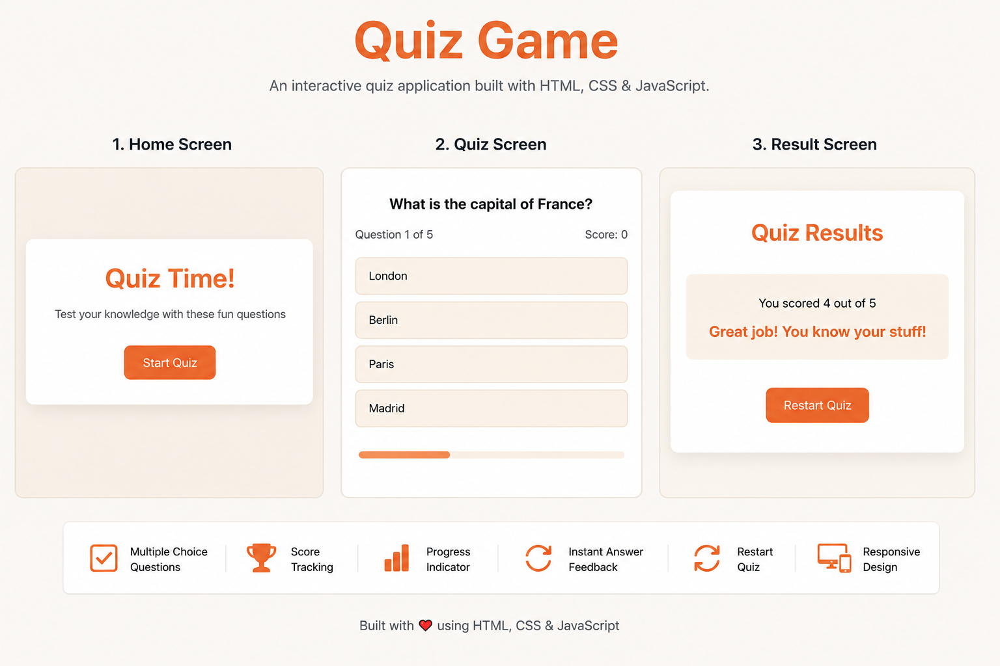

# 🧠 Quiz Game

A responsive and interactive Quiz Game built using HTML, CSS, and JavaScript. The application presents multiple-choice questions, checks answers instantly, tracks the user's score, displays progress, and shows the final result at the end of the quiz.

---


## 🚀 Live Demo

https://js-quiz-game-gilt.vercel.app/


---

## 🚀 Features

- Interactive multiple-choice quiz
- Instant answer validation
- Score tracking
- Progress bar
- Responsive design
- Restart quiz functionality
- Clean and modern UI

---

## 🛠️ Technologies Used

- HTML5
- CSS3
- JavaScript (ES6)

---

## 📂 Project Structure

```
Quiz-App/
│
├── index.html
├── style.css
├── script.js
├── README.md
└── assets/
    ├── quiz-preview.png
```

---

## 📸 Application Preview

The image below shows different screens of the Quiz Game application.




---

## ▶️ How to Run

1. Download or clone this repository.
2. Open the project folder.
3. Open `index.html` in your browser.

No installation is required.

---

## 📖 What I Learned

While building this project, I practiced:

- DOM Manipulation
- Event Handling
- Arrays and Objects
- Dynamic HTML Creation
- JavaScript Functions
- Conditional Statements
- Progress Bar Implementation
- Responsive Design

---

## 🔮 Future Improvements

- Timer for each question
- Random question order
- Categories
- Difficulty levels
- Local Storage for High Score
- Sound Effects

---

## 👨‍💻 Author

MOHD AMAN

GitHub:
https://github.com/mohdaman-codes

---

⭐ If you like this project, consider giving it a star.